# 🚀 Ultimate Supabase Setup Guide for Brooks
*(A Visual, Step-by-Step Learning Experience)*

---

## 🧠 What are we building? (The Big Picture)

Imagine your application is a **Restaurant**.
- **The Services (Java Apps):** These are the **Chefs**. They cook data.
- **Supabase:** This is the massive, organized **Fridge** (Database).
- **The Connection:** These are the **Runners** taking ingredients back and forth.

We need to give your "Chefs" the keys to the "Fridge" so they can store and retrieve data.

### 🏛️ The Architecture

We will use the **Simple & Robust** approach compatible with Supabase's Free Tier.

```mermaid
graph TD
    subgraph "Your Cloud (VM)"
        Auth[🔐 Auth Service]
        Social[👥 Social Service]
        Lists[📝 Lists Service]
    end

    subgraph "Supabase (The Cloud Database)"
        Pooler[🛡️ Connection Pooler]
        DB[(🗄️ Main 'postgres' DB)]
    end

    Auth -->|Credentials| Pooler
    Social -->|Credentials| Pooler
    Lists -->|Credentials| Pooler
    Pooler --> DB
```



> **💡 Rookie Note:** We use the default database named `postgres`. Why? Because Supabase's beautiful dashboard **only** allows you to see and edit data in the `postgres` database. If we made a custom one, the dashboard wouldn't work!

---

## 🗺️ Mission 1: Create Your Supabase Project

**Goal:** Get your own slice of the cloud.

### Step 1: Sign Up & Create
1.  Go to [database.new](https://database.new) (redirects to Supabase).
2.  **Sign in** with GitHub.
3.  Click the big green button: **`New Project`**.

### Step 2: Fill the Form (The "Creation" Window)

| Field | Value to Enter | Why? |
| :--- | :--- | :--- |
| **Organization** | *Select yours* | Who owns this? |
| **Name** | `brooks-prod` | Your project name. |
| **Database Password** | 🔐 *Generate Strong* | **IMPORTANT:** Copy this to a notepad immediately! You cannot see it again. |
| **Region** | *Choose closest to users* | Less distance = Faster app. |
| **Pricing Plan** | Free ($0) | Good for starting. |

> ⚠️ **STOP!** Did you save that password? You will need it in 5 minutes.

---

## 🔌 Mission 2: Get the Keys (Connection Details)

**Goal:** Find the specific address and secret codes your Java apps need.

### Step 1: Navigate to Database Settings
Look at the left sidebar icon menu.

```text
  [ ⚡ ]  <- Dashboard
  [ 📝 ]  <- Table Editor
  [ 🔌 ]  <- Database (Click this icon, looks like a cylinder or disconnected plugs)
  [ ⚙️ ]  <- Settings
```
*If you can't find it, go to `Settings (Cog icon) > Database`.*

### Step 2: Configure the Connection Info
You will see a section called **Connection parameters**.

1.  Look for a toggle switch at the top of this box.
2.  **Turn ON** `Use connection pooling` (Checked ✅).
    *   *Analogy:* Instead of opening a new door every time a chef needs an egg, we keep one door open with a guard. It's faster and safer.
3.  **Mode:** Select `Session`.
    *   *Why?* Java apps (using Hibernate) like to keep the conversation going ("Session").

### Step 3: Copy Your Credentials
You need these 4 distinct pieces of information. Copy them into your notepad.

| Variable | Where to find it | Example Format |
| :--- | :--- | :--- |
| **Host** | Settings → Database → Connection string (Direct) | `db.<project-ref>.supabase.co` |
| **Port** | Direct connection port | `5432` |
| **User** | Direct connection user | `postgres` |
| **Database**| Labelled `Database` | `postgres` (Default) |

---

## 🔗 Mission 3: Wire It Up (The Configuration)

**Goal:** Teach your Java apps where the database is.

We need to construct a **JDBC URL**. This is like a mailing address for Java programs.

### 🏗️ Constructing the URL
Format:
`jdbc:postgresql://HOST:PORT/DATABASE?sslmode=require`

**Example (Visual Builder):**
```text
jdbc:postgresql://
   + [Host from Step 3]                 (e.g., db.fpfoqgncloqmbqqikrsq.supabase.co)
   + :
   + [Port from Step 3]                 (5432)
   + /
   + [Database from Step 3]             (e.g., postgres)
   + ?sslmode=require
```

**Final Result should look like:**
`jdbc:postgresql://db.<project-ref>.supabase.co:5432/postgres?sslmode=require`

### 📝 Where to paste this?
You will save these in your environment file (`.env` or server configuration).

**For EVERY service (Auth, Social, etc.), use the same credentials:**

```ini
# ----------------------------------------
# 🔐 DATABASE CONFIGURATION
# ----------------------------------------

# The URL we just built
AUTH_DB_URL=jdbc:postgresql://db.<project-ref>.supabase.co:5432/postgres?sslmode=require

# The User from Step 3
AUTH_DB_USER=postgres

# The Password you saved in Mission 1 (Step 2)
AUTH_DB_PASSWORD=your-super-secret-password
```

> **repeat this pattern for:**
> `SOCIAL_DB_...`
> `LISTS_DB_...`
> `PINS_DB_...`
> `MODERATION_DB_...`

---

## 🛡️ Mission 4: Security & Management

### 🔄 Rotating Passwords (If you get hacked)
If you think someone stole your database password:
1. Go to Supabase Dashboard > Settings > Database.
2. Scroll to **"Database Password"**.
3. Click **"Reset Database Password"**.
4. Update your `.env` files with the new one.
5. Restart your apps.

### 🙈 Why can't I see my tables in Supabase?
**Common Rookie Mistake:**
If your app creates tables but you don't see them in the "Table Editor" on the dashboard:
1. Did you create a separate database named `brooks`?
   *   *Fix:* Supabase UI only shows the `postgres` database. Change your URL to connect to `postgres`.
2. Are the tables in a different "Schema"?
   *   *Fix:* The UI defaults to the `public` schema. Look for a schema dropdown in the top-left of the Table Editor to switch views.

---

## ✅ Checklist: Did we succeed?

- [ ] **Project Created:** You have a Supabase project URL.
- [ ] **Password Saved:** You have the password in a password manager.
- [ ] **Connection Info:** You have the direct Host (`db.<ref>.supabase.co`), Port (5432), and User (`postgres`).
- [ ] **URL Built:** You constructed the `jdbc:postgresql://...` string.
- [ ] **Env Updated:** You pasted these into your `.env` file.

**Ready to launch!** 🚀

